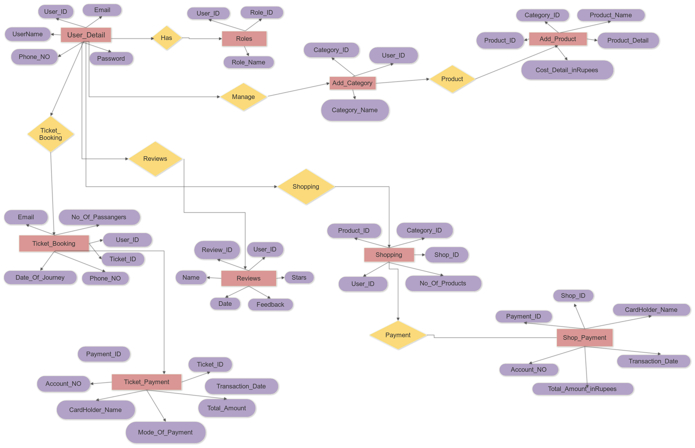
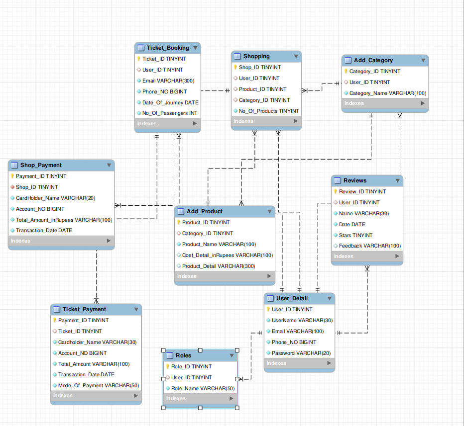

## Disney Holiday Hype:

### 1.Create Project Database:

```syntax
create database Disney_Holiday_Hype;
```
###### Query OK, 1 row affected (0.01 sec)

```syntax
CREATE DATABASE DHH_DisneyWorld;
```
###### Query OK, 1 row affected (0.01 sec)


```syntax
SHOW DATABASES;
```

| Database            |
|:--------------------|
| Disney_Holiday_Hype |
| case_when           |
| constraints         |
| fwsa_batch2         |
| information_schema  |
| jerusheya           |
| mysql               |
| performance_schema  |
| personl_practice    |
| project             |
| school              |
| sys                 |
| tcl                 |
| views               |

###### 14 rows in set (0.01 sec)


```syntax
USE Disney_Holiday_Hype;
```

###### Database changed

```syntax
SHOW TABLES;
```

| Tables_in_Disney_Holiday_Hype |
|:------------------------------|
| Add_Category                  |
| Add_Product                   |
| Reviews                       |
| Roles                         |
| Shop_Payment                  |
| Shopping                      |
| Ticket_Booking                |
| Ticket_Payment                |
| User_Detail                   |

###### 9 rows in set (0.00 sec)


### 2.Table creations:

#### 1.User_Detail table:

```syntax
CREATE TABLE User_Detail (User_ID tinyint PRIMARY KEY AUTO_INCREMENT,UserName varchar(30) NOT NULL,Email varchar(100) UNIQUE NOT NULL,Phone_NO int UNIQUE NOT NULL,Password varchar(20) UNIQUE NOT NULL);
```

###### Query OK, 0 rows affected (0.02 sec)

```syntax
DESC User_Detail;
```

| Field    | Type         | Null | Key | Default | Extra          |
|:---------|:-------------|:-----|:----|:--------|:---------------|
| User_ID  | tinyint      | NO   | PRI | NULL    | auto_increment |
| UserName | varchar(30)  | NO   |     | NULL   |                |
| Email    | varchar(100) | NO   | UNI | NULL    |                |
| Phone_NO | int          | NO   | UNI | NULL    |                |
| Password | varchar(20)  | NO   | UNI | NULL    |                |

###### 5 rows in set (0.01 sec)

#### 2. Roles table:

```syntax
CREATE TABLE Roles (Role_ID tinyint PRIMARY KEY AUTO_INCREMENT,User_ID tinyint, Role_Name varchar(50) NOT NULL,FOREIGN KEY(User_ID) REFERENCES User_Detail(User_ID));
```
###### Query OK, 0 rows affected (0.04 sec)

```syntax
DESC Roles;
```

| Field     | Type        | Null | Key | Default | Extra          |
|:----------|:------------|:-----|:----|:--------|:---------------|
| Role_ID   | tinyint     | NO   | PRI | NULL    | auto_increment |
| User_ID   | tinyint     | YES  | MUL | NULL    |                |
| Role_Name | varchar(50) | NO   |     | NULL    |                |

###### 3 rows in set (0.00 sec)

#### 3. Add_Category table:

```syntax
CREATE TABLE Add_Category (Category_ID tinyint PRIMARY KEY AUTO_INCREMENT,User_ID tinyint,Category_Name varchar(100) UNIQUE NOT NULL,FOREIGN KEY(User_ID) REFERENCES User_Detail(User_ID));
```
###### Query OK, 0 rows affected (0.07 sec)

```syntax
DESC Add_Category;
```

| Field         | Type         | Null | Key | Default | Extra          |
|:--------------|:-------------|:-----|:----|:--------|:---------------|
| Category_ID   | tinyint      | NO   | PRI | NULL    | auto_increment |
| User_ID       | tinyint      | YES  | MUL | NULL    |                |
| Category_Name | varchar(100) | NO   | UNI | NULL    |                |

###### 3 rows in set (0.00 sec)

#### 4.Add_Product table:

```syntax
CREATE TABLE Add_Product (Product_ID tinyint PRIMARY KEY AUTO_INCREMENT,Category_ID tinyint,Product_Name varchar(100) NOT NULL,Cost_Detail_inRupees varchar(100),Product_Detail varchar(300),FOREIGN KEY(Category_ID) REFERENCES Add_Category(Category_ID));
```
###### Query OK, 0 rows affected (0.06 sec)

```syntax
DESC Add_Product;
```

| Field                | Type         | Null | Key | Default | Extra          |
|:---------------------|:-------------|:-----|:----|:--------|:---------------|
| Product_ID           | tinyint      | NO   | PRI | NULL    | auto_increment |
| Category_ID          | tinyint      | YES  | MUL | NULL    |                |
| Product_Name         | varchar(100) | NO   |     | NULL    |                |
| Cost_Detail_inRupees | varchar(100) | YES  |     | NULL    |                |
| Product_Detail       | varchar(300) | YES  |     | NULL    |                |

###### 5 rows in set (0.00 sec)
#### 5. Shopping table:

```syntax
CREATE TABLE Shopping (Shop_ID tinyint PRIMARY KEY AUTO_INCREMENT,User_ID tinyint,Product_ID tinyint,Category_ID tinyint,No_Of_Products tinyint, FOREIGN KEY(User_ID) REFERENCES User_Detail(User_ID),FOREIGN KEY(Product_ID) REFERENCE Add_Product(Product_ID),FOREIGN KEY(Category_ID) REFERENCES Add_Category(Category_ID));
```

```syntax
DESC Shopping;
```

| Field          | Type    | Null | Key | Default | Extra          |
|:---------------|:--------|:-----|:----|:--------|:---------------|
| Shop_ID        | tinyint | NO   | PRI | NULL    | auto_increment |
| User_ID        | tinyint | YES  | MUL | NULL    |                |
| Product_ID     | tinyint | YES  | MUL | NULL    |                |
| Category_ID    | tinyint | YES  | MUL | NULL    |                |
| No_Of_Products | tinyint | NO   |     | NULL    |                |

###### 5 rows in set (0.01 sec)

#### 6. Shop_Payment table:

```syntax
CREATE TABLE Shop_Payment (Payment_ID tinyint PRIMARY KEY AUTO_INCREMENT,Shop_ID tinyint NOT NULL,CardHolder_Name varchar(20) NOT NULL,Account_NO bigint NOT NULL,Total_Amount_inRupees varchar(100) NOT NULL,Transaction_Date DATE NOT NULL,FOREIGN KEY(Shop_ID) REFERENCES Shopping(Shop_ID));
```
###### Query OK, 0 rows affected (0.05 sec)

```syntax
DESC Shop_Payment;
```

| Field                 | Type         | Null | Key | Default | Extra          |
|:----------------------|:-------------|:-----|:----|:--------|:---------------|
| Payment_ID            | tinyint      | NO   | PRI | NULL    | auto_increment |
| Shop_ID               | tinyint      | NO   | MUL | NULL    |                |
| CardHolder_Name       | varchar(20)  | NO   |     | NULL    |                |
| Account_NO            | bigint       | NO   |     | NULL    |                |
| Total_Amount_inRupees | varchar(100) | NO   |     | NULL    |                |
| Transaction_Date      | date         | NO   |     | NULL    |                |

###### 6 rows in set (0.00 sec)

#### 7.Reviews table:

```syntax
 CREATE TABLE Reviews (Review_ID tinyint PRIMARY KEY AUTO_INCREMENT,User_ID tinyint,Name varchar(30) NOT NULL,Date DATE NOT NULL,Stars tinyint NOT NULL,Feedback varchar(100),FOREIGN KEY (User_ID) REFERENCES User_Detail (User_ID));
 ```
###### Query OK, 0 rows affected (0.09 sec)

```syntax
DESC Reviews;
```

| Field     | Type         | Null | Key | Default | Extra          |
|:----------|:-------------|:-----|:----|:--------|:---------------|
| Review_ID | tinyint      | NO   | PRI | NULL    | auto_increment |
| User_ID   | tinyint      | YES  | MUL | NULL    |                |
| Name      | varchar(30)  | NO   |     | NULL    |                |
| Date      | date         | NO   |     | NULL    |                |
| Stars     | tinyint      | NO   |     | NULL    |                |
| Feedback  | varchar(100) | YES  |     | NULL    |                |

###### 6 rows in set (0.01 sec)

#### 8. Ticket_Booking table:

```syntax
CREATE TABLE Ticket_Booking (Ticket_ID tinyint PRIMARY KEY AUTO_INCREMENT,User_ID tinyint,Email varchar(300) NOT NULL,Phone_NO bigint NOT NULL,Date_Of_Journey DATE NOT NULL,No_Of_Passengers int NOT NULL,FOREIGN KEY(User_ID) REFERENCES User_Detail(User_ID));
```
###### Query OK, 0 rows affected (0.06 sec)

```syntax
DESC Ticket_Booking;
```

| Field            | Type         | Null | Key | Default | Extra          |
|:-----------------|:-------------|:-----|:----|:--------|:---------------|
| Ticket_ID        | tinyint      | NO   | PRI | NULL    | auto_increment |
| User_ID          | tinyint      | YES  | MUL | NULL    |                |
| Email            | varchar(300) | NO   |     | NULL    |                |
| Phone_NO         | bigint       | NO   |     | NULL    |                |
| Date_Of_Journey  | date         | NO   |     | NULL    |                |
| No_Of_Passengers | int          | NO   |     | NULL    |                |

###### 6 rows in set (0.01 sec)

#### 9. Ticket_Payment table:

```syntax
CREATE TABLE Ticket_Payment (Payment_ID tinyint PRIMARY KEY AUTO_INCREMENT,Ticket_ID tinyint,Cardholder_Name varchar(30) NOT NULL,Acccount_NO bigint NOT NULL,Total_Amount varchar(100) NOT NULL,Transaction_Date DATE NOT NULL,Mode_Of_Payment varchar(50) NOT NULL,FOREIGN KEY(Ticket_ID) REFERENCES Ticket_Booking(Ticket_ID));
```
###### Query OK, 0 rows affected (0.06 sec)

```syntax
DESC Ticket_Payment;
```

| Field            | Type         | Null | Key | Default | Extra          |
|:-----------------|:-------------|:-----|:----|:--------|:---------------|
| Payment_ID       | tinyint      | NO   | PRI | NULL    | auto_increment |
| Ticket_ID        | tinyint      | YES  | MUL | NULL    |                |
| Cardholder_Name  | varchar(30)  | NO   |     | NULL    |                |
| Acccount_NO      | bigint       | NO   |     | NULL    |                |
| Total_Amount     | varchar(100) | NO   |     | NULL    |                |
| Transaction_Date | date         | NO   |     | NULL    |                |
| Mode_Of_Payment  | varchar(50)  | NO   |     | NULL    |                |

###### 7 rows in set (0.01 sec)

### 3. Inserting values into tables:

#### 1. Insert into User_Detail :
```select
INSERT INTO User_Detail VALUES (2,'Oliver white','oliverwhite234@gmail.com','9898877665','oliverwhite@234'),(3,'Noah Roberts','noahroberts345@gmail.com','8765432109','noahroberts@345'),(4,'Olivia
Jackson','oliviajackson456@gmail.com','7654321098','oliviajackson@456'),(5,'Ava Smith','avasmith567@gmail.com','9999966666','avasmith@567');
```
###### ERROR 1264 (22003): Out of range value for column 'Phone_NO' at row 1
##### Shows error because the datatype of phone_no is int.

##### alter the column Phone_NO :

```syntax
ALTER TABLE User_Detail MODIFY Phone_NO bigint UNIQUE NOT NULL;
```
###### Query OK, 1 row affected, 1 warning (0.17 sec)
###### Records: 1  Duplicates: 0  Warnings: 1

```syntax
INSERT INTO User_Detail VALUES (2,'Oliver white','oliverwhite234@gmail.com','9898877665','oliverwhite@234'),(3,'Noah Roberts','noahroberts345@gmail.com','8765432109','noahroberts@345'),(4,'Olivia
Jackson','oliviajackson456@gmail.com','7654321098','oliviajackson@456'),(5,'Ava Smith','avasmith567@gmail.com','9999966666','avasmith@567');
```
###### Query OK, 4 rows affected (0.01 sec)
###### Records: 4  Duplicates: 0  Warnings: 0


```syntax
SELECT * FROM User_Detail;
```
### Output table 1:

| User_ID | UserName       | Email                      | Phone_NO   | Password          |
|:--------|:---------------|:---------------------------|:-----------|:------------------|
|       1 | James Williams | jameswilliams123@gmail.com | 1234567891 | james@123         |
|       2 | Oliver white   | oliverwhite234@gmail.com   | 9898877665 | oliverwhite@234   |
|       3 | Noah Roberts   | noahroberts345@gmail.com   | 8765432109 | noahroberts@345   |
|       4 | Olivia Jackson | oliviajackson456@gmail.com | 7654321098 | oliviajackson@456 |
|       5 | Ava Smith      | avasmith567@gmail.com      | 9999966666 | avasmith@567      |

###### 5 rows in set (0.00 sec)

```syntax
INSERT INTO User_Detail VALUES (6,'Robinson','robinson678@gmail.com','8898877665','robinson@678'),(7,'Johnson','johnson898@gmail.com','8765432898','johnson@898'),(8,'Shruthihasan','shrithihasan654@gmail.com','7654378998','sruthihasan@654'),(9,'Juliet','juliet23456@gmail.com','9967896666','juliet@23456'),(10,'Daphne Christina','daphnechristina@2002gmail.com','9363232559','daphne@christina');
```

###### Query OK, 5 rows affected (0.01 sec)
###### Records: 5  Duplicates: 0  Warnings: 0

```syntax
SELECT * FROM User_Detail;
```

| User_ID | UserName         | Email                         | Phone_NO   | Password          |
|:--------|:-----------------|:------------------------------|:-----------|:------------------|
|       1 | James Williams   | jameswilliams123@gmail.com    | 1234567891 | james@123         |
|       2 | Oliver white     | oliverwhite234@gmail.com      | 9898877665 | oliverwhite@234   |
|       3 | Noah Roberts     | noahroberts345@gmail.com      | 8765432109 | noahroberts@345   |
|       4 | Olivia Jackson   | oliviajackson456@gmail.com    | 7654321098 | oliviajackson@456 |
|       5 | Ava Smith        | avasmith567@gmail.com         | 9999966666 | avasmith@567      |
|       6 | Robinson         | robinson678@gmail.com         | 8898877665 | robinson@678      |
|       7 | Johnson          | johnson898@gmail.com          | 8765432898 | johnson@898       |
|       8 | Shruthihasan     | shrithihasan654@gmail.com     | 7654378998 | sruthihasan@654   |
|       9 | Juliet           | juliet23456@gmail.com         | 9967896666 | juliet@23456      |
|      10 | Daphne Christina | daphnechristina@2002gmail.com | 9363232559 | daphne@christina  |

###### 10 rows in set (0.00 sec)

#### 2.Insert into Roles:

```syntax
INSERT INTO Roles VALUES (1,1,'User'),(2,2,'Admin'),(3,3,'User'),(4,4,'Admin'),(5,5,'User'),(6,6,'Admin'),(7,7,'User'),(8,8,'User'),(9,9,'User'),(10,10,'User');
```
###### Query OK, 10 rows affected (0.01 sec)
###### Records: 10  Duplicates: 0  Warnings: 0

```syntax
SELECT * FROM Roles;
```

| Role_ID | User_ID | Role_Name |
|:--------|:--------|:----------|
|       1 |       1 | User      |
|       2 |       2 | Admin     |
|       3 |       3 | User      |
|       4 |       4 | Admin     |
|       5 |       5 | User      |
|       6 |       6 | Admin     |
|       7 |       7 | User      |
|       8 |       8 | User      |
|       9 |       9 | User      |
|      10 |      10 | User      |

###### 10 rows in set (0.00 sec)

#### add constraint check:

```syntax
ALTER TABLE Reviews ADD CONSTRAINT CHECK(Stars<=5);
```
###### Query OK, 0 rows affected (0.12 sec)
###### Records: 0  Duplicates: 0  Warnings: 0

#### 3. Insert into Reviews:

```syntax
INSERT INTO Reviews VALUES (1,1,'James Williams','2022-01-03',4,'This is just awesome'),(2,3,'Noah Roberts','2022-02-02',5,'It is awesome to have shopping and ticketbooking at once'),(3,5,'Ava Smith','2021-12-28',4,'Awaiting to create more memories with you'),(4,7,'Johnson','2021-11-21',3,'This is a great website for disney lovers'),(5,8,'Shruthi','2022-02-12',4,'Great and enjoyable trip'),(6,9,'Juli','2022-01-18',5,'I just loved it'),(7,10,'Daphne','2022-02-02',4,'Just give it a try to experience the beauty');
```
###### Query OK, 7 rows affected (0.02 sec)
###### Records: 7  Duplicates: 0  Warnings: 0

```syntax
SELECT * FROM Reviews;
```

| Review_ID | User_ID | Name           | Date       | Stars | Feedback                                                 |
|:----------|:--------|:---------------|:-----------|:------|:---------------------------------------------------------|
|         1 |       1 | James Williams | 2022-01-03 |     4 | This is just awesome                                     |
|         2 |       3 | Noah Roberts   | 2022-02-02 |     5 | It is awesome to have shopping and ticketbooking at once |
|         3 |       5 | Ava Smith      | 2021-12-28 |     4 | Awaiting to create more memories with you                |
|         4 |       7 | Johnson        | 2021-11-21 |     3 | This is a great website for disney lovers                |
|         5 |       8 | Shruthi        | 2022-02-12 |     4 | Great and enjoyable trip                                 |
|         6 |       9 | Juli           | 2022-01-18 |     5 | I just loved it                                          |
|         7 |      10 | Daphne         | 2022-02-02 |     4 | Just give it a try to experience the beauty              |

###### 7 rows in set (0.00 sec)

#### 4.Insert into Ticket_Booking:

```syntax
INSERT INTO Ticket_Booking VALUES (1,1,'jameswilliams123@gmail.com','1234567891','2022-05-23','20'),(2,3,'noahroberts345@gmail.com','8765432109','2022-08-26','5'),(3,5,'avasmith567@gmail.com','9999966666','2022-07-15','8'),(4,7,'johnson898@gmail.com','8765432898','2022-05-10','3'),(5,8,'shrithihasan654@gmail.com','7654378998','2022-07-17','15'),(6,9,'juliet23456@gmail.com','9967896666','2022-09-29','10'),(7,10,'daphnechristina@2002gmail.com','9363232559','2022-08-16','12');
```
###### Query OK, 7 rows affected (0.01 sec)
###### Records: 7  Duplicates: 0  Warnings: 0

```syntax
SELECT * FROM Ticket_Booking;
```

| Ticket_ID | User_ID | Email                         | Phone_NO   | Date_Of_Journey | No_Of_Passengers |
|:----------|:--------|:------------------------------|:-----------|:----------------|:-----------------|
|         1 |       1 | jameswilliams123@gmail.com    | 1234567891 | 2022-05-23      |               20 |
|         2 |       3 | noahroberts345@gmail.com      | 8765432109 | 2022-08-26      |                5 |
|         3 |       5 | avasmith567@gmail.com         | 9999966666 | 2022-07-15      |                8 |
|         4 |       7 | johnson898@gmail.com          | 8765432898 | 2022-05-10      |                3 |
|         5 |       8 | shrithihasan654@gmail.com     | 7654378998 | 2022-07-17      |               15 |
|         6 |       9 | juliet23456@gmail.com         | 9967896666 | 2022-09-29      |               10 |
|         7 |      10 | daphnechristina@2002gmail.com | 9363232559 | 2022-08-16      |               12 |

###### 7 rows in set (0.00 sec)

#### 5.Insert into Ticket_Payment:

```syntax
INSERT INTO Ticket_Payment VALUES (10,4,'Johnson','8394859282938472','Rs.10,000','2022-03-24','Gpay'),(11,6,'Juliet','7834783489239012','Rs.10,000','2022-07-01','NetBanking'),(12,7,'Daphne Christina','2345345645675678','Rs.30,000','2022-05-03','Gpay');
```
###### Query OK, 3 rows affected (0.01 sec)
###### Records: 3  Duplicates: 0  Warnings: 0


```syntax
UPDATE Ticket_Payment SET Acccount_NO='7463727282917256' WHERE Payment_ID=6;
```
###### Query OK, 1 row affected (0.01 sec)
###### Rows matched: 1  Changed: 1  Warnings: 0

#### renaming a column:
```syntax
ALTER TABLE Ticket_Payment RENAME COLUMN Acccount_NO TO Account_NO;
```
###### Query OK, 0 rows affected (0.03 sec)
###### Records: 0  Duplicates: 0  Warnings: 0

```syntax
SELECT * FROM Ticket_Payment;
```

| Payment_ID | Ticket_ID | Cardholder_Name  | Account_NO       | Total_Amount | Transaction_Date | Mode_Of_Payment |
|:-----------|:----------|:-----------------|:-----------------|:-------------|:-----------------|:----------------|
|          1 |         1 | James Williams   | 2345678923456789 | Rs.20,000    | 2022-01-02       | Gpay            |
|          2 |         2 | Noah Roberts     | 2783456729383746 | Rs.50,000    | 2022-03-19       | NetBanking      |
|          3 |         3 | Ava Smith        | 8765432198765432 | Rs.30,000    | 2022-05-23       | Cash            |
|          4 |         4 | Johnson          | 8394859282938472 | Rs.40,000    | 2022-02-13       | Gpay            |
|          5 |         1 | James Williams   | 2345678923456789 | Rs.30,000    | 2022-03-13       | Gpay            |
|          6 |         5 | Shruthi hasan    | 7463727282917256 | Rs.50,000    | 2022-03-09       | Cash            |
|          7 |         3 | Ava Smith        | 8765432198765432 | Rs.20,000    | 2022-06-01       | Cash            |
|          8 |         6 | Juliet           | 7834783489239012 | Rs.40,000    | 2022-06-09       | NetBanking      |
|          9 |         7 | Daphne Christina | 2345345645675678 | Rs.20,000    | 2022-04-04       | Gpay            |
|         10 |         4 | Johnson          | 8394859282938472 | Rs.10,000    | 2022-03-24       | Gpay            |
|         11 |         6 | Juliet           | 7834783489239012 | Rs.10,000    | 2022-07-01       | NetBanking      |
|         12 |         7 | Daphne Christina | 2345345645675678 | Rs.30,000    | 2022-05-03       | Gpay            |


###### 12 rows in set (0.00 sec)

#### 6. Insert into Add_Category:

```syntax
INSERT INTO Add_Category VALUES (1,2,'Kids'),(2,4,'Men'),(3,2,'Women'),(4,2,'Gadgets'),(5,4,'Toys'),(6,6,'Homeware'),(7,6,'Fashion and Accessories'),(8,2,'Stationery'),(9,4,'Backpacks'),(10,6,'Serveware'),(11,2,'Comfort Tees');
```
###### Query OK, 11 rows affected (0.01 sec)
###### Records: 11  Duplicates: 0  Warnings: 0

```syntax
SELECT * FROM Add_Category;
```

| Category_ID | User_ID | Category_Name           |
|:------------|:--------|:------------------------|
|           1 |       2 | Kids                    |
|           2 |       4 | Men                     |
|           3 |       2 | Women                   |
|           4 |       2 | Gadgets                 |
|           5 |       4 | Toys                    |
|           6 |       6 | Homeware                |
|           7 |       6 | Fashion and Accessories |
|           8 |       2 | Stationery              |
|           9 |       4 | Backpacks               |
|          10 |       6 | Serveware               |
|          11 |       2 | Comfort Tees            |

###### 11 rows in set (0.00 sec)

#### 7.Insert into Add_Product:
```syntax
INSERT INTO Add_Product VALUES (1,1,'Marvel Spider-Man Blue Sweatshirt','Rs.840','Blue color and for kids');
```
###### Query OK, 1 row affected (0.01 sec)

```syntax
INSERT INTO Add_Product VALUES (2,1,'Star Wars Watch','Rs.639','1 year warranty black and white watch'),(3,2,'Mickey and Friends Sweatshirt','Rs.800','Red sweatshirt for men'),(4,3,'Disney Mickey
Cloth set','Rs.450','4 set of kerchief'),(5,3,'Disney Princess Navy Blue Hoodle','Rs.920','Gauranteed Hoodle for women'),(6,4,'Disney Mickey Mouse Kids Battery Powered LED Torch','Rs.349','3 years of warranty'),(7,4,'Disney Minnie Mouse kids interchangable Frame Sunglasses','Rs.699','2 years of warranty and red coloured'),(8,5,'Hamley Toys','Rs.1199','12 number of toys'),(9,5,'Disney Frozen Toy Storage
Box','Rs.499','for above 3 years kids');
```
###### Query OK, 8 rows affected (0.01 sec)
###### Records: 8  Duplicates: 0  Warnings: 0

```syntax
INSERT INTO Add_Product VALUES (10,6,'Disney Frozen Multipurpose Ludo game table','Rs.499','can be used in 3 different ways'),(11,6,'Fun Homes Disney Mickey Mouse and Friends Pillows','Rs.870','Reverisble pillows pack of 4'),(12,6,'Mickey mouse Bath Towel','Rs.585','Soft as feather'),(13,6,'SPACES mickey Cotton Single Bed Dohar','Rs.1999','5 years of warranty'),(14,7,',Adidas kids trainers Disney
 Mickey FortaRun shoes','Rs.1600','Fast running shoes with great grip'),(15,8,'Disney Minnie mouse pencil pouch','Rs.399','Red with white coloured'),(16,8,'Disney Princess 5 in 1 writing Board','Rs.999','can be used in 5 different ways');
 ```
###### Query OK, 7 rows affected (0.00 sec)
###### Records: 7  Duplicates: 0  Warnings: 0

```syntax
INSERT INTO Add_Product VALUES (17,8,'Fame forever casual shoes','Rs.1699','Pink coloured shoes with 1 year warranty'),(18,10,'Disney Frozen Cherry Mug','Rs.359','Blue coloured'),(19,10,'Disney Mouse Johny Vacuum Insulated Red water bottles','Rs.599','2 years of warranty'),(20,11,'Pixar Car t-shirt','Rs.431','t-shirt for both men and women');
```
###### Query OK, 4 rows affected (0.01 sec)
###### Records: 4  Duplicates: 0  Warnings: 0

```syntax
SELECT * FROM Add_Product;
```

| Product_ID | Category_ID | Product_Name                                             | Cost_Detail_inRupees | Product_Detail                           |
|:-----------|:------------|:---------------------------------------------------------|:---------------------|:-----------------------------------------|
|          1 |           1 | Marvel Spider-Man Blue Sweatshirt                        | Rs.840               | Blue color and for kids                  |
|          2 |           1 | Star Wars Watch                                          | Rs.639               | 1 year warranty black and white watch    |
|          3 |           2 | Mickey and Friends Sweatshirt                            | Rs.800               | Red sweatshirt for men                   |
|          4 |           3 | Disney Mickey Cloth set                                  | Rs.450               | 4 set of kerchief                        |
|          5 |           3 | Disney Princess Navy Blue Hoodle                         | Rs.920               | Gauranteed Hoodle for women              |
|          6 |           4 | Disney Mickey Mouse Kids Battery Powered LED Torch       | Rs.349               | 3 years of warranty                      |
|          7 |           4 | Disney Minnie Mouse kids interchangable Frame Sunglasses | Rs.699               | 2 years of warranty and red coloured     |
|          8 |           5 | Hamley Toys                                              | Rs.1199              | 12 number of toys                        |
|          9 |           5 | Disney Frozen Toy Storage Box                            | Rs.499               | for above 3 years kids                   |
|         10 |           6 | Disney Frozen Multipurpose Ludo game table               | Rs.499               | can be used in 3 different ways          |
|         11 |           6 | Fun Homes Disney Mickey Mouse and Friends Pillows        | Rs.870               | Reverisble pillows pack of 4             |
|         12 |           6 | Mickey mouse Bath Towel                                  | Rs.585               | Soft as feather                          |
|         13 |           6 | SPACES mickey Cotton Single Bed Dohar                    | Rs.1999              | 5 years of warranty                      |
|         14 |           7 | ,Adidas kids trainers Disney Mickey FortaRun shoes       | Rs.1600              | Fast running shoes with great grip       |
|         15 |           8 | Disney Minnie mouse pencil pouch                         | Rs.399               | Red with white coloured                  |
|         16 |           8 | Disney Princess 5 in 1 writing Board                     | Rs.999               | can be used in 5 different ways          |
|         17 |           8 | Fame forever casual shoes                                | Rs.1699              | Pink coloured shoes with 1 year warranty |
|         18 |          10 | Disney Frozen Cherry Mug                                 | Rs.359               | Blue coloured                            |
|         19 |          10 | Disney Mouse Johny Vacuum Insulated Red water bottles    | Rs.599               | 2 years of warranty                      |
|         20 |          11 | Pixar Car t-shirt                                        | Rs.431               | t-shirt for both men and women           |


###### 20 rows in set (0.00 sec)

#### 8.Insert into Shopping:

```syntax
INSERT INTO Shopping VALUES (1,1,3,2,2),(2,1,5,3,1),(3,3,10,6,3),(4,5,12,6,5),(5,7,20,11,1),(6,5,2,1,10),(7,8,7,4,2),(8,7,16,8,4),(9,9,13,6,3),(10,10,5,3,5),(11,10,10,6,7);
```
###### Query OK, 11 rows affected (0.02 sec)
###### Records: 11  Duplicates: 0  Warnings: 0
```syntax
SELECT * FROM Shopping;
```

| Shop_ID | User_ID | Product_ID | Category_ID | No_Of_Products |
|:--------|:--------|:-----------|:------------|:---------------|
|       1 |       1 |          3 |           2 |              2 |
|       2 |       1 |          5 |           3 |              1 |
|       3 |       3 |         10 |           6 |              3 |
|       4 |       5 |         12 |           6 |              5 |
|       5 |       7 |         20 |          11 |              1 |
|       6 |       5 |          2 |           1 |             10 |
|       7 |       8 |          7 |           4 |              2 |
|       8 |       7 |         16 |           8 |              4 |
|       9 |       9 |         13 |           6 |              3 |
|      10 |      10 |          5 |           3 |              5 |
|      11 |      10 |         10 |           6 |              7 |

###### 11 rows in set (0.00 sec)

#### 9.Insert into Shop_Payment:

```syntax
 INSERT INTO Shop_Payment VALUES (5,2,'James Williams','2345678923456789','Rs.1390','2022-03-23'),(6,7,'Shruthihasan','7463727282917256','Rs.1390','2022-04-02'),(7,6,'Ava Smith','8765432198765432','Rs.6390','2022-05-20'),(8,11,'Daphne Christina','2345345645675678','Rs.3493','2022-04-24'),(9,10,'Daphne Christina','2345345645675678','Rs.4600','2022-03-22'),(10,8,'Johnson','8394859282938472','Rs.3996','2022-04-03'),(11,9,'Juliet','7834783489239012','Rs.1997','2021-11-22'),(12,2,'James Williams','2345678923456789','Rs.400','2021-12-30'),(13,9,'Juliet','7834783489239012','Rs.4000','2022-01-29');
 ```
###### Query OK, 9 rows affected (0.01 sec)
###### Records: 9  Duplicates: 0  Warnings: 0

```syntax
SELECT * FROM Shop_Payment;
```

| Payment_ID | Shop_ID | CardHolder_Name  | Account_NO       | Total_Amount_inRupees | Transaction_Date |
|:-----------|:--------|:-----------------|:-----------------|:----------------------|:-----------------|
|          1 |       1 | James Williams   | 2345678923456789 | Rs.1600               | 2022-02-23       |
|          2 |       3 | Noah Roberts     | 2783456729383746 | Rs.1497               | 2021-12-24       |
|          3 |       4 | Ava Smith        | 8765432198765432 | Rs.2925               | 2022-03-13       |
|          4 |       5 | Johnson          | 8394859282938472 | Rs.431                | 2022-04-20       |
|          5 |       2 | James Williams   | 2345678923456789 | Rs.1390               | 2022-03-23       |
|          6 |       7 | Shruthihasan     | 7463727282917256 | Rs.1390               | 2022-04-02       |
|          7 |       6 | Ava Smith        | 8765432198765432 | Rs.6390               | 2022-05-20       |
|          8 |      11 | Daphne Christina | 2345345645675678 | Rs.3493               | 2022-04-24       |
|          9 |      10 | Daphne Christina | 2345345645675678 | Rs.4600               | 2022-03-22       |
|         10 |       8 | Johnson          | 8394859282938472 | Rs.3996               | 2022-04-03       |
|         11 |       9 | Juliet           | 7834783489239012 | Rs.1997               | 2021-11-22       |
|         12 |       2 | James Williams   | 2345678923456789 | Rs.400                | 2021-12-30       |
|         13 |       9 | Juliet           | 7834783489239012 | Rs.4000               | 2022-01-29       |

###### 13 rows in set (0.00 sec)

### Database ER Diagram:



### Database EER Diagram:


